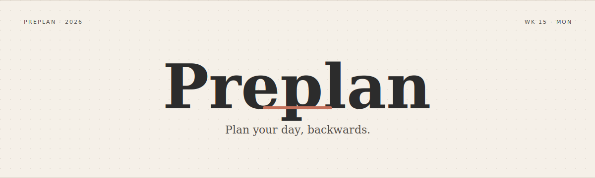
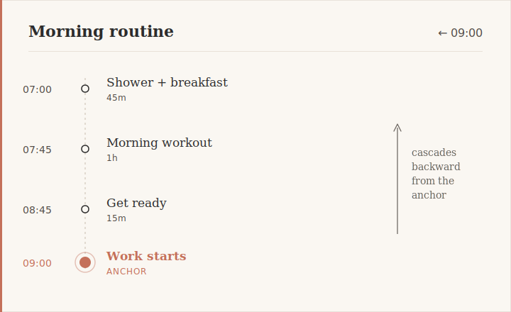
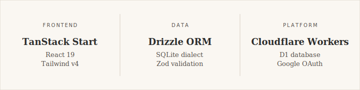

<p align="center">
  
</p>

# Preplan

A personal planning tool for people who plan **backwards from commitments**.
Build time-anchored "chains" of events that cascade from a fixed time — then
export the whole thing to Google Calendar, automatically.

Live at **[preplan.fletcheaston.com](https://preplan.fletcheaston.com)**.

---

## How it works

Every chain has one **hard-anchored moment** — the thing that can't move.
Everything else cascades backward (or forward) from there. No drag-to-fit,
no manual time math. Change a duration, the whole chain recomputes.

<p align="center">
  
</p>

## Features

- **Time-anchored chains** — events cascade forward or backward from a fixed moment
- **Day & week views** — mobile defaults to the day you're in, desktop to the whole week
- **Drag-to-reorder** events within a chain
- **Copy day / copy week** with optional global time offset, and a "clear existing" toggle for clean slates
- **One-way Google Calendar sync** — mutations push to a dedicated "Preplan" calendar, per-event timezone
- **Installable PWA** — works offline-graceful on iOS and Android, respects notch & home-indicator safe areas
- **Multi-user** from day one — every query scoped by `userId`

## Stack

<p align="center">
  
</p>

Design direction: **Ink & Paper** — warm cream background (`#F5F0E8`), charcoal ink
(`#2C2C2C`), terracotta accents (`#C4705A`). Typography: *Literata* (serif) +
*DM Mono* (times, durations).

## Local development

Requires Node.js 20+ and a Google OAuth client (create one at
[console.cloud.google.com](https://console.cloud.google.com) with
`http://localhost:3000/auth/callback` as an authorized redirect URI).

```bash
# Install
npm install

# Create .env.local with your OAuth credentials
cat > .env.local <<EOF
GOOGLE_CLIENT_ID=your-client-id.apps.googleusercontent.com
GOOGLE_CLIENT_SECRET=your-client-secret
SESSION_SECRET=any-random-32-char-string
VITE_BASE_URL=http://localhost:3000
EOF

# Apply migrations to the local SQLite DB
DATABASE_URL=local.db npm run db:push

# Start the dev server
npm run dev
```

The app runs at `http://localhost:3000`. `better-sqlite3` is lazy-loaded on the
server only — never sent to the browser.

## Deployment (Cloudflare Workers + D1)

```bash
# Create the D1 database (once)
wrangler d1 create preplan

# Apply migrations to remote D1
wrangler d1 migrations apply preplan --remote

# Set secrets
wrangler secret put GOOGLE_CLIENT_ID
wrangler secret put GOOGLE_CLIENT_SECRET
wrangler secret put SESSION_SECRET

# Build and deploy
npm run build
wrangler deploy
```

Production uses D1 via the `cloudflare:workers` env binding (no better-sqlite3
on the edge). The `nodejs_compat_populate_process_env` flag makes secrets
available to code that expects `process.env`.

## Scripts

```
npm run dev           # Vite dev server at :3000
npm run build         # Production build
npm run test          # Vitest (time-derivation unit tests)
npm run lint          # oxlint
npm run format        # Prettier
npm run db:generate   # Generate a new Drizzle migration
npm run db:push       # Push schema to local SQLite (dev only)
```

## Architecture notes

- **No stored start/end times.** Events only have a `duration` and a
  `sortOrder`; start and end are always derived from the chain's anchor +
  direction. See [`src/lib/time.ts`](src/lib/time.ts).
- **Chains span midnight** if their durations carry them there. The
  anchor day owns the chain; derived start/end dates may differ.
- **Server functions** (`createServerFn`) handle the client/server boundary
  — TanStack Start strips handler bodies from the client bundle.
- **Per-event timezone** — stored from the browser at creation time via
  `Intl.DateTimeFormat().resolvedOptions().timeZone`, used when syncing to
  Google Calendar.

## License

[MIT](LICENSE) © Fletcher Easton
